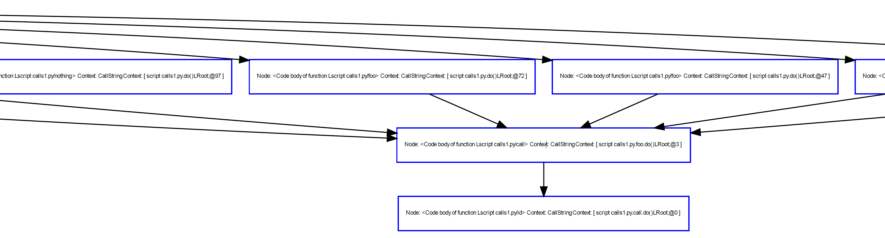
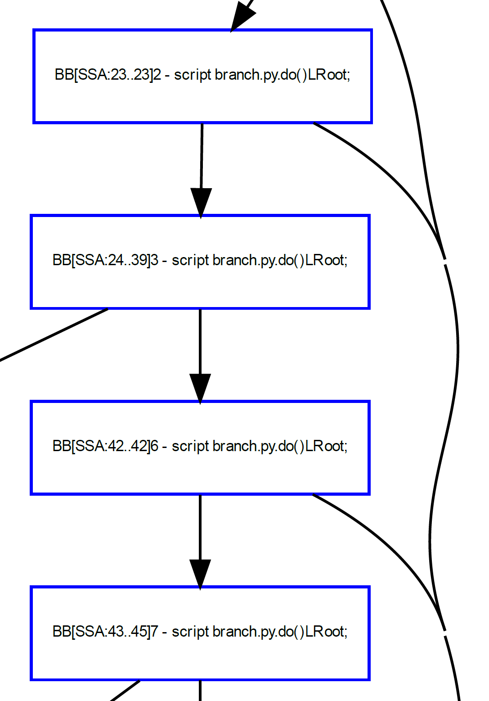
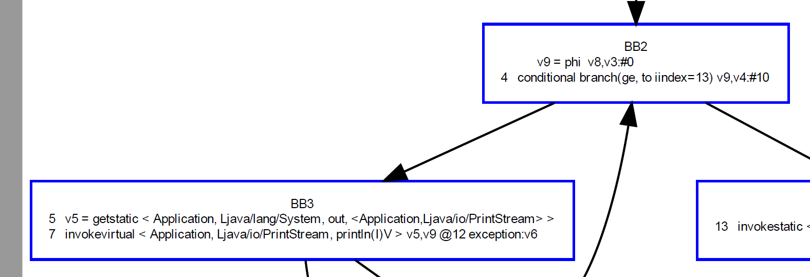
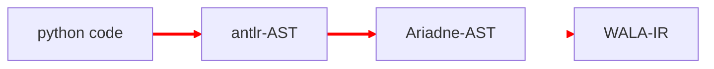

# 進捗報告(5/11)

## おしながき
- Ariadneの調査
- Type Analysis for JavaScript(SAS '09)

## Ariadneの調査
解析の実装にAriadne（Python版WALA）を使うことになった

### 前回のタスク
提案手法の実装に、Ariadneで提供されている解析手法のどれを使っていくか吟味

### やってみたこと
サンプルコードを作成して、実際に解析してみた。
- 和田さんが作り残してくれたWALAのtutorialをベースに

class hierarchy解析、call graph解析、control flow graph解析を実行

### つまってるところ
#### WALAほどAPIがそろっていない
WALAならば、不要なedgeをpruneすることが可能。Ariadneではできない
その辺の実装が必要

#### 出力情報がWALAと違う
<!--  -->
<!--  -->

<!--  -->
<!--  -->

左がAriadn、右がWALA

WALAのような情報を取り出したくても、中間表現(WALA IR)になっていて対応関係が分らない

### 結局、コードを1から読む

## Type Analysis for JavaScript
- 前方解析の精度を上げるために読む
    - backward解析の負担が減り、scalabilityが向上(しそう)
- 読んで分かったこと＝この提案手法はscalabilityはなさそう
    - 続編を読まなくては

### 貢献
- 抽象解釈を用いてJavaScriptの特異な文法に対応した型解析手法の提案を行う
- soundnessかつ、annotationなしに解析が可能なことが新規性

### 論文の推しポイント
解析のlatticeを細かく設定することにより、JavaScriptの特異な文法に対しても、preciseな解析が可能となった

|---|Analysis|
|---|---|
|Domain           |<ここをメチャクチャ工夫した>|
|Direction        |forward|
|Transfer function|***|
|Boundary         |OUT(ENTRY) = $\phi$ |
|Meet             |$\cup$|
|Equation         |$OUT[B] = f_B(IN[B]) \\IN[B] = \land_{P, pred(B)} OUT[P]$|
|Initialization   |$OUT[B] = \phi$|

### Abstract value
$\mathit{Value = Undef × Null × Bool × Num × String × \{行番号\} }$

例）
- x = ($\bot$, null, $\bot$, $\bot$, "baz", $\phi$)
    - xはnullか"baz"という文字列
- y = (undef, $\bot$, $\bot$, $\bot$, $\bot$,  $\{l_{42}, l_{87}\}$)
    - yはundefか42or87行目で作成されたオブジェクト

なぜこのような定義にしたか
⇒ *field sensitiveに解析を行いたい*

### scalabilityがあるのか？
(エラーのないコードに対し、FPが出なかった割合)
|benchmark|lines|call/ construct|var read|property access|time(s)|
|---------|---------|---------|---------|---------|---------|
|richard.js|529|95%|100%|93%|<10|
|benchpress.js|463|100%|100%|89%|<10|
|delta-blue.js|853|78%|100%|82%|360|
|3d-cube.js|342|100%|100%|92%|<10|
|3d-raytrace.js|446|99%|100%|94%|30|
|crypto-md5.js|291|100%|100%|100%|<10|
|access-nbody.js|174|100%|100%|93%|<10|

著者自身も「今回の目的はprecisionの向上であり、performance(analysis time & memory consumption)は考えていない」と言及

### これを踏まえて
- このバージョンのTAJSをそのまま実装しても効果は薄そう
- 続編を要チェック
    - Interprocedural Analysis with Lazy Propagation(SAS '09)
        - abstractに「lazy propagationを使用したことでperformanceが向上」
    - Determinacy in Static Analysis for jQuery(OOPSLA '14)
        - TAJSVRの実装の基礎に使われた研究

## 予定
- 今週中
    - TAJS完読＆続編読む
    - Ariadne理解
- 来週頭(5/17)～
    - TAJS実装開始(~5月いっぱい)
- 6月～
    - backward解析の実装